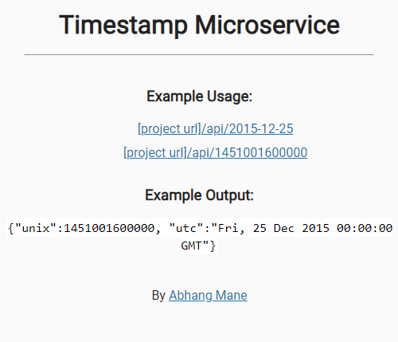

# Timestamp Microservice

This is the boilerplate code for the Timestamp Microservice project. Instructions for building your project can be found at https://www.freecodecamp.org/learn/apis-and-microservices/apis-and-microservices-projects/timestamp-microservice

- **Final Output**  
  
